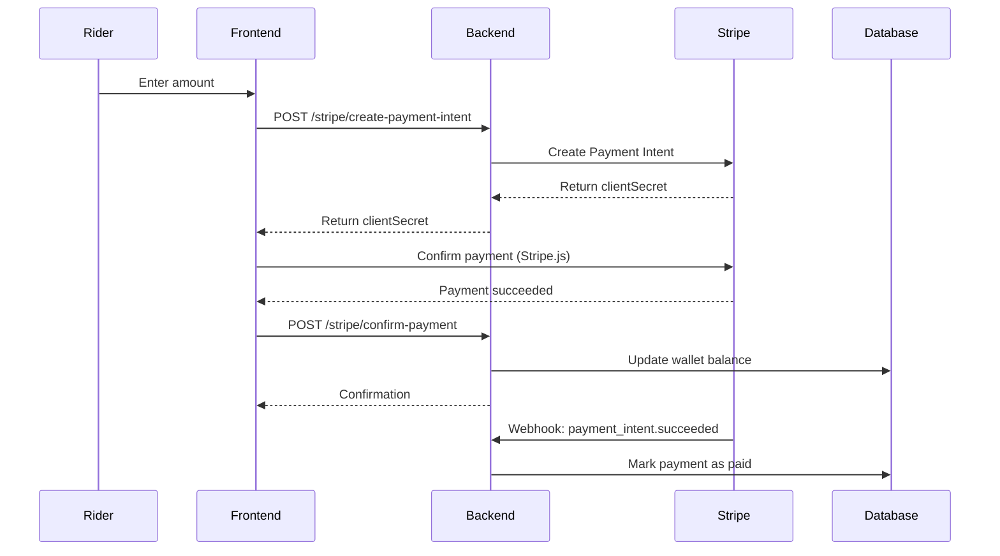
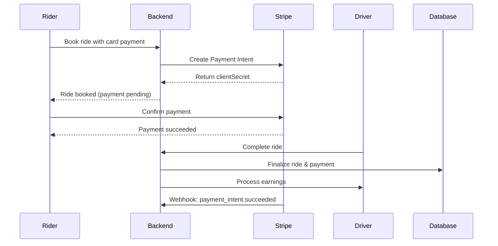
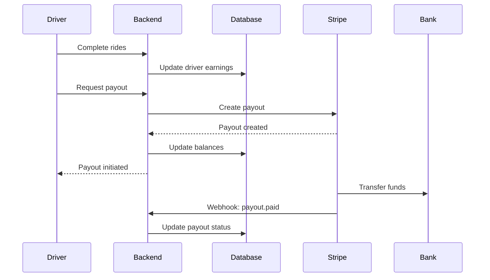

# Stripe Payment Integration - GO-CATERHAM

Complete Stripe payment integration for the GO-CATERHAM taxi app, supporting wallet top-ups, ride payments, saved payment methods, refunds, and driver payouts via Stripe Connect.

---

## Table of Contents

1. [Overview](#overview)
2. [Features](#features)
3. [Architecture](#architecture)
4. [Environment Setup](#environment-setup)
5. [API Endpoints](#api-endpoints)
6. [Payment Flows](#payment-flows)
7. [Testing](#testing)
8. [Security Considerations](#security-considerations)
9. [Troubleshooting](#troubleshooting)

---

## Overview

This integration provides a complete payment solution using Stripe for:
- **Riders**: Wallet top-ups, ride payments, and saved payment methods
- **Drivers**: Earnings tracking and automated payouts via Stripe Connect
- **Platform**: Payment processing, refunds, and commission management

**Supported Currencies**: GBP (default), USD, EUR, CAD, AUD

---

## Features

### ✅ For Riders

1. **Wallet Top-Up**
   - Add funds to wallet using credit/debit cards
   - Secure payment processing via Stripe Payment Intents
   - Real-time wallet balance updates

2. **Direct Ride Payments**
   - Pay for rides directly with saved or new cards
   - Automatic payment capture on ride completion
   - Support for cash and wallet payments as well

3. **Saved Payment Methods**
   - Save cards for future use (tokenized via Stripe)
   - Manage multiple payment methods
   - Set default payment method
   - View masked card details

4. **Refunds**
   - Full or partial refunds for cancelled/disputed rides
   - Automatic wallet credit for refunded wallet payments

### ✅ For Drivers

1. **Stripe Connect Integration**
   - Secure bank account connection via Stripe
   - Automated onboarding process
   - Compliance with banking regulations

2. **Earnings Tracking**
   - Real-time earnings updates after each ride
   - Breakdown: base earnings, tips, bonuses
   - Daily, weekly, and monthly summaries

3. **Automated Payouts**
   - Request payouts to connected bank account
   - Track payout history
   - Available and pending balance management

### ✅ For Platform/Admins

1. **Payment Management**
   - Process refunds for customer service
   - View all transactions and payment history
   - Manual payout processing for drivers

2. **Webhooks**
   - Real-time payment status updates
   - Automatic handling of payment events
   - Stripe Connect account status updates

---

## Architecture

### Database Models

#### Updated Models

**Payment Model** (`models/Payment.js`)
```javascript
{
  ride: ObjectId,
  rider: ObjectId,
  driver: ObjectId,
  amount: Number,
  currency: String, // 'gbp', 'usd', 'eur', etc.
  status: String, // 'pending', 'paid', 'refunded', 'failed', 'canceled'
  paymentMethod: String, // 'cash', 'card', 'wallet'
  
  // Stripe fields
  stripePaymentIntentId: String,
  stripeCustomerId: String,
  stripePaymentMethodId: String,
  stripeChargeId: String,
  stripeRefundId: String,
  
  paymentDetails: {
    last4: String,
    brand: String,
    expiryMonth: Number,
    expiryYear: Number
  },
  
  refundDetails: {
    refundedAmount: Number,
    refundReason: String,
    refundedAt: Date
  },
  
  metadata: Map,
  failureReason: String,
  description: String
}
```

**PaymentMethod Model** (`models/PaymentMethod.js`)
```javascript
{
  rider: ObjectId,
  type: String, // 'card', 'paypal', 'apple_pay', 'google_pay'
  isDefault: Boolean,
  provider: String, // 'stripe', 'paypal', etc.
  status: String, // 'active', 'expired', 'failed'
  
  // Stripe fields
  stripePaymentMethodId: String,
  stripeCustomerId: String,
  fingerprint: String,
  
  card: {
    last4: String,
    brand: String,
    expiryMonth: Number,
    expiryYear: Number,
    cardholderName: String
  }
}
```

**Rider Model** (`models/Rider.js`)
```javascript
{
  // ... existing fields
  
  // Stripe fields
  stripeCustomerId: String,
  stripeCustomerCreatedAt: Date
}
```

**Driver Model** (`models/Driver.js`)
```javascript
{
  // ... existing fields
  
  // Stripe Connect fields
  stripeConnectAccountId: String,
  stripeAccountStatus: String, // 'pending', 'enabled', 'disabled', 'rejected'
  stripeAccountCreatedAt: Date,
  stripeOnboardingCompleted: Boolean,
  
  earnings: {
    totalEarned: Number,
    availableBalance: Number,
    pendingBalance: Number,
    totalPaidOut: Number,
    lastPayoutAt: Date,
    currency: String
  }
}
```

### Services

**Stripe Service** (`services/stripeService.js`)
- Customer management (create, update, delete)
- Payment Intents (create, confirm, cancel)
- Payment Methods (attach, detach, list, set default)
- Charges (create with saved payment methods)
- Refunds (create, retrieve)
- Stripe Connect (create accounts, onboarding, payouts)
- Webhooks (signature verification, event handling)
- Utility methods (currency conversion, formatting)

---

## Environment Setup

### 1. Install Dependencies

Already added to `package.json`:
```bash
npm install stripe
```

### 2. Environment Variables

Create a `.env` file with the following variables:

```bash
# Stripe API Keys (Test Mode)
STRIPE_TEST_SECRET_KEY=sk_test_xxxxx
STRIPE_TEST_PUBLISHABLE_KEY=pk_test_xxxxx
STRIPE_TEST_WEBHOOK_SECRET=whsec_xxxxx

# Stripe API Keys (Production Mode)
STRIPE_SECRET_KEY=sk_live_xxxxx
STRIPE_PUBLISHABLE_KEY=pk_live_xxxxx
STRIPE_WEBHOOK_SECRET=whsec_xxxxx

# Environment
NODE_ENV=development  # or 'production'

# Frontend URL (for Stripe Connect redirects)
FRONTEND_URL=http://localhost:3000
```

### 3. Stripe Dashboard Setup

1. **Create a Stripe Account**: https://dashboard.stripe.com/register
2. **Get API Keys**: Dashboard → Developers → API Keys
3. **Enable Stripe Connect**: Dashboard → Connect → Get Started
4. **Create Webhook Endpoint**:
   - URL: `https://yourdomain.com/api/v1/stripe/webhook`
   - Events to subscribe:
     - `payment_intent.succeeded`
     - `payment_intent.payment_failed`
     - `payment_method.attached`
     - `payment_method.detached`
     - `charge.refunded`
     - `account.updated`
     - `payout.paid`
     - `payout.failed`

---

## API Endpoints

### Public Endpoints

#### Get Stripe Configuration
```http
GET /api/v1/stripe/config
```

**Response:**
```json
{
  "success": true,
  "data": {
    "publishableKey": "pk_test_xxxxx",
    "environment": "development"
  }
}
```

#### Get Supported Currencies
```http
GET /api/v1/stripe/currencies
```

**Response:**
```json
{
  "success": true,
  "data": [
    { "code": "GBP", "symbol": "£" },
    { "code": "USD", "symbol": "$" },
    { "code": "EUR", "symbol": "€" },
    { "code": "CAD", "symbol": "CA$" },
    { "code": "AUD", "symbol": "A$" }
  ]
}
```

---

### Rider Endpoints (Authenticated)

#### 1. Create Payment Intent (Wallet Top-Up)

```http
POST /api/v1/stripe/create-payment-intent
Authorization: Bearer <token>
Content-Type: application/json
```

**Request Body:**
```json
{
  "amount": 50.00,
  "currency": "gbp",
  "description": "Wallet top-up",
  "rideId": "optional_ride_id_for_direct_payment"
}
```

**Response:**
```json
{
  "success": true,
  "message": "Payment intent created successfully",
  "data": {
    "clientSecret": "pi_xxxxx_secret_xxxxx",
    "paymentIntentId": "pi_xxxxx",
    "paymentId": "payment_mongo_id",
    "amount": 5000,
    "currency": "gbp"
  }
}
```

**Frontend Integration:**
```javascript
// Use the clientSecret with Stripe.js
const stripe = Stripe('pk_test_xxxxx');
const { error, paymentIntent } = await stripe.confirmCardPayment(clientSecret, {
  payment_method: {
    card: cardElement,
    billing_details: { name: 'John Doe' }
  }
});
```

#### 2. Confirm Payment

```http
POST /api/v1/stripe/confirm-payment
Authorization: Bearer <token>
Content-Type: application/json
```

**Request Body:**
```json
{
  "paymentIntentId": "pi_xxxxx"
}
```

**Response:**
```json
{
  "success": true,
  "message": "Payment confirmed successfully",
  "data": {
    "paymentId": "payment_mongo_id",
    "status": "paid",
    "amount": 50.00,
    "currency": "gbp"
  }
}
```

#### 3. Save Payment Method

```http
POST /api/v1/stripe/save-payment-method
Authorization: Bearer <token>
Content-Type: application/json
```

**Request Body:**
```json
{
  "paymentMethodId": "pm_xxxxx",
  "setAsDefault": true
}
```

**Response:**
```json
{
  "success": true,
  "message": "Payment method saved successfully",
  "data": {
    "_id": "payment_method_mongo_id",
    "type": "card",
    "isDefault": true,
    "card": {
      "last4": "4242",
      "brand": "visa",
      "expiryMonth": 12,
      "expiryYear": 2025
    },
    "maskedCard": "**** **** **** 4242"
  }
}
```

#### 4. List Payment Methods

```http
GET /api/v1/stripe/payment-methods
Authorization: Bearer <token>
```

**Response:**
```json
{
  "success": true,
  "count": 2,
  "data": [
    {
      "_id": "pm_mongo_id_1",
      "type": "card",
      "isDefault": true,
      "card": {
        "last4": "4242",
        "brand": "visa",
        "expiryMonth": 12,
        "expiryYear": 2025
      },
      "maskedCard": "**** **** **** 4242",
      "isExpired": false
    },
    {
      "_id": "pm_mongo_id_2",
      "type": "card",
      "isDefault": false,
      "card": {
        "last4": "5555",
        "brand": "mastercard",
        "expiryMonth": 6,
        "expiryYear": 2024
      },
      "maskedCard": "**** **** **** 5555",
      "isExpired": false
    }
  ]
}
```

#### 5. Delete Payment Method

```http
DELETE /api/v1/stripe/payment-methods/:id
Authorization: Bearer <token>
```

**Response:**
```json
{
  "success": true,
  "message": "Payment method deleted successfully"
}
```

#### 6. Set Default Payment Method

```http
PUT /api/v1/stripe/payment-methods/:id/default
Authorization: Bearer <token>
```

**Response:**
```json
{
  "success": true,
  "message": "Default payment method updated successfully",
  "data": {
    "_id": "pm_mongo_id",
    "isDefault": true,
    // ... other fields
  }
}
```

---

### Driver Endpoints (Authenticated)

#### 1. Create Stripe Connect Account

```http
POST /api/v1/stripe/connect/create-account
Authorization: Bearer <driver_token>
```

**Response:**
```json
{
  "success": true,
  "message": "Stripe Connect account created successfully",
  "data": {
    "accountId": "acct_xxxxx"
  }
}
```

#### 2. Get Onboarding Link

```http
GET /api/v1/stripe/connect/onboarding-link
Authorization: Bearer <driver_token>
```

**Response:**
```json
{
  "success": true,
  "data": {
    "url": "https://connect.stripe.com/setup/s/xxxxx"
  }
}
```

**Usage:**
Redirect driver to this URL to complete bank account setup.

#### 3. Get Connect Account Status

```http
GET /api/v1/stripe/connect/account-status
Authorization: Bearer <driver_token>
```

**Response:**
```json
{
  "success": true,
  "data": {
    "accountId": "acct_xxxxx",
    "chargesEnabled": true,
    "payoutsEnabled": true,
    "onboardingComplete": true,
    "status": "enabled"
  }
}
```

#### 4. Get Driver Earnings

```http
GET /api/v1/drivers/earnings/summary
Authorization: Bearer <driver_token>
```

**Response:**
```json
{
  "success": true,
  "data": {
    "totalEarnings": {
      "amount": 1250.50,
      "baseEarnings": 1200.00,
      "tips": 40.50,
      "bonuses": 10.00,
      "currency": "gbp"
    },
    "availableBalance": 1250.50,
    "pendingBalance": 0,
    "totalPaidOut": 500.00,
    "lastPayoutAt": "2024-01-15T10:30:00.000Z",
    "periodBreakdown": {
      "today": {
        "earnings": 85.50,
        "rides": 5
      },
      "thisWeek": {
        "earnings": 425.00,
        "rides": 28
      },
      "thisMonth": {
        "earnings": 1250.50,
        "rides": 87
      }
    },
    "totalRides": 87,
    "stripeAccountStatus": "enabled",
    "stripeOnboardingCompleted": true
  }
}
```

#### 5. Request Payout

```http
POST /api/v1/drivers/earnings/payout
Authorization: Bearer <driver_token>
Content-Type: application/json
```

**Request Body:**
```json
{
  "amount": 500.00
}
```

**Response:**
```json
{
  "success": true,
  "message": "Payout requested successfully",
  "data": {
    "payoutId": "po_xxxxx",
    "amount": 500.00,
    "currency": "gbp",
    "status": "pending",
    "expectedArrival": "2024-01-17T00:00:00.000Z"
  }
}
```

---

### Admin Endpoints (Authenticated)

#### 1. Create Refund

```http
POST /api/v1/stripe/refund
Authorization: Bearer <admin_token>
Content-Type: application/json
```

**Request Body:**
```json
{
  "paymentId": "payment_mongo_id",
  "amount": 25.00,
  "reason": "requested_by_customer"
}
```

**Response:**
```json
{
  "success": true,
  "message": "Refund processed successfully",
  "data": {
    "refundId": "re_xxxxx",
    "amount": 25.00,
    "status": "succeeded"
  }
}
```

#### 2. Process Driver Payout (Admin)

```http
POST /api/v1/stripe/connect/payout
Authorization: Bearer <admin_token>
Content-Type: application/json
```

**Request Body:**
```json
{
  "driverId": "driver_mongo_id",
  "amount": 300.00
}
```

**Response:**
```json
{
  "success": true,
  "message": "Payout created successfully",
  "data": {
    "payoutId": "po_xxxxx",
    "amount": 300.00,
    "currency": "gbp",
    "status": "in_transit"
  }
}
```

---

### Webhook Endpoint

#### Stripe Webhook Handler

```http
POST /api/v1/stripe/webhook
Stripe-Signature: t=xxxxx,v1=xxxxx
Content-Type: application/json
```

**Automatically handles:**
- `payment_intent.succeeded` - Mark payment as paid
- `payment_intent.payment_failed` - Mark payment as failed
- `payment_method.attached` - Log payment method attachment
- `payment_method.detached` - Log payment method removal
- `charge.refunded` - Update payment refund status
- `account.updated` - Update driver Connect account status
- `payout.paid` - Log successful payout
- `payout.failed` - Log failed payout

**Response:**
```json
{
  "received": true
}
```

---

## Payment Flows

### 1. Wallet Top-Up Flow



**Steps:**

1. **Rider initiates top-up**
   - Enters amount (e.g., £50)
   - Selects or enters card details

2. **Backend creates Payment Intent**
   - Creates Stripe customer if needed
   - Creates payment intent with amount
   - Returns `clientSecret` to frontend

3. **Frontend confirms payment**
   - Uses Stripe.js to handle card details securely
   - Stripe processes payment (3D Secure if required)

4. **Backend confirms and updates wallet**
   - Verifies payment status
   - Adds funds to wallet
   - Sends real-time notification

5. **Webhook confirms** (async)
   - Stripe sends webhook event
   - Backend marks payment as completed

### 2. Ride Payment Flow (Card)



**Steps:**

1. **Rider books ride** with card payment method
2. **Payment intent created** during booking
3. **Payment confirmed** before/during ride
4. **Ride completed** by driver
5. **Payment finalized** and driver earnings processed

### 3. Driver Payout Flow



**Steps:**

1. **Driver completes rides** - Earnings accumulate
2. **Driver requests payout** - Minimum threshold check
3. **Stripe processes payout** - Transfers to bank
4. **Funds arrive** - Usually 2-3 business days
5. **Webhook confirms** - Status updated

---

## Testing

### Test Cards (Stripe Test Mode)

| Card Number | Brand | Scenario |
|-------------|-------|----------|
| 4242 4242 4242 4242 | Visa | Successful payment |
| 4000 0025 0000 3155 | Visa | Requires 3D Secure |
| 4000 0000 0000 9995 | Visa | Insufficient funds |
| 4000 0000 0000 0002 | Visa | Card declined |
| 5555 5555 5555 4444 | Mastercard | Successful payment |

**Use any:**
- Future expiry date (e.g., 12/25)
- Any 3-digit CVC
- Any billing postal code

### Testing Wallet Top-Up

```bash
# 1. Create payment intent
curl -X POST http://localhost:5000/api/v1/stripe/create-payment-intent \
  -H "Authorization: Bearer YOUR_TOKEN" \
  -H "Content-Type: application/json" \
  -d '{
    "amount": 50,
    "currency": "gbp",
    "description": "Test wallet top-up"
  }'

# 2. Use returned clientSecret in frontend with Stripe.js
# 3. Confirm payment
curl -X POST http://localhost:5000/api/v1/stripe/confirm-payment \
  -H "Authorization: Bearer YOUR_TOKEN" \
  -H "Content-Type: application/json" \
  -d '{
    "paymentIntentId": "pi_xxxxx"
  }'
```

### Testing Webhooks Locally

Use Stripe CLI for local webhook testing:

```bash
# Install Stripe CLI
# https://stripe.com/docs/stripe-cli

# Login to Stripe
stripe login

# Forward webhooks to local server
stripe listen --forward-to localhost:5000/api/v1/stripe/webhook

# Trigger test events
stripe trigger payment_intent.succeeded
stripe trigger payment_intent.payment_failed
```

---

## Security Considerations

### ✅ Best Practices Implemented

1. **Never Store Card Details**
   - All card data handled by Stripe
   - Only store Stripe tokens/IDs

2. **Webhook Signature Verification**
   - All webhooks verified with Stripe signature
   - Prevents unauthorized requests

3. **Payment Intent Flow**
   - Secure 3D Secure (SCA) support
   - Prevents unauthorized charges

4. **Customer IDs**
   - Stripe customers tied to app users
   - Prevents cross-customer access

5. **HTTPS Required**
   - All Stripe API calls use HTTPS
   - Webhook endpoint must use HTTPS in production

6. **API Key Security**
   - Secret keys stored in environment variables
   - Never exposed to frontend
   - Publishable keys safe for frontend

### ⚠️ Important Security Notes

- **Publishable Key**: Safe to expose in frontend code
- **Secret Key**: NEVER expose (backend only)
- **Webhook Secret**: Required for webhook verification
- **Test vs Live**: Always use test keys in development

---

## Troubleshooting

### Common Issues

#### 1. Payment Intent Creation Fails

**Error**: `Stripe customer not found`

**Solution**:
- Ensure rider profile exists
- Check `stripeCustomerId` is being saved
- Verify Stripe API keys are correct

#### 2. Webhook Not Receiving Events

**Error**: Webhook endpoint not responding

**Solution**:
- Verify webhook URL is accessible (use ngrok for local testing)
- Check webhook secret is correct
- Ensure raw body is available for signature verification
- Check Stripe dashboard → Webhooks → Event logs

#### 3. Payment Confirmation Fails

**Error**: `Payment intent not found`

**Solution**:
- Verify `paymentIntentId` is correct
- Check payment intent hasn't expired (24 hours)
- Ensure frontend properly handles 3D Secure

#### 4. Driver Payout Fails

**Error**: `Insufficient balance` or `Account not enabled`

**Solution**:
- Check driver's available balance
- Verify Stripe Connect onboarding is complete
- Check account status in Stripe dashboard

#### 5. Webhook Signature Verification Fails

**Error**: `Webhook signature verification failed`

**Solution**:
- Ensure raw body is passed to verification
- Check webhook secret matches Stripe dashboard
- Verify body parsing middleware order in app.js

---

## Database Migration Notes

If upgrading from an existing system:

```javascript
// Run this script to add Stripe fields to existing records

// Update existing riders
await Rider.updateMany(
  { stripeCustomerId: { $exists: false } },
  { $set: { stripeCustomerId: null, stripeCustomerCreatedAt: null } }
);

// Update existing drivers
await Driver.updateMany(
  { stripeConnectAccountId: { $exists: false } },
  {
    $set: {
      stripeConnectAccountId: null,
      stripeAccountStatus: 'pending',
      stripeOnboardingCompleted: false,
      earnings: {
        totalEarned: 0,
        availableBalance: 0,
        pendingBalance: 0,
        totalPaidOut: 0,
        currency: 'gbp'
      }
    }
  }
);

// Update existing payments
await Payment.updateMany(
  { currency: { $exists: false } },
  {
    $set: {
      currency: 'gbp',
      stripePaymentIntentId: null,
      stripeCustomerId: null,
      stripePaymentMethodId: null
    }
  }
);
```

---

## Support & Resources

- **Stripe Documentation**: https://stripe.com/docs
- **Stripe Connect Guide**: https://stripe.com/docs/connect
- **Payment Intents Guide**: https://stripe.com/docs/payments/payment-intents
- **Testing Guide**: https://stripe.com/docs/testing
- **Stripe CLI**: https://stripe.com/docs/stripe-cli

---

## Summary

This integration provides a complete, production-ready Stripe payment system for GO-CATERHAM with:

✅ Secure wallet top-ups  
✅ Direct ride payments  
✅ Saved payment methods  
✅ Refund processing  
✅ Driver payouts via Connect  
✅ Multi-currency support  
✅ Webhook handling  
✅ Comprehensive error handling  
✅ Real-time notifications  

**Next Steps:**
1. Set up Stripe account and get API keys
2. Configure environment variables
3. Test in development with test mode
4. Complete Stripe Connect verification
5. Deploy webhook endpoint
6. Switch to live mode for production
